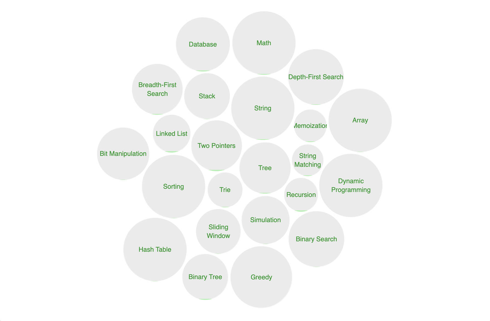

# 🚀 LeetCode Solutions — Java & Kotlin

This repository documents my journey in solving algorithmic problems with a focus on **software engineering interviews**, **problem-solving patterns**, and **code quality at scale**.

---

## 👨‍💻 LeetCode Profile

📊 https://leetcode.com/u/zeroufal/

---

## 🎯 Engineering Focus

Beyond solving problems, this repository emphasizes:

- Writing **clean, maintainable code**
- Identifying and applying **reusable patterns**
- Understanding **trade-offs between approaches**
- Communicating solutions clearly (as in real-world code reviews)

---

## 🧠 Core Patterns & Topics

- Arrays & Strings
- Hashing (HashMap / HashSet)
- Two Pointers & Sliding Window
- Stack & Monotonic Stack
- Trees & Binary Trees (DFS / BFS)
- Graphs (Traversal, Topological Sort)
- Recursion & Backtracking
- Dynamic Programming (Top-down & Bottom-up)

---

## 📂 Repository Structure

leetcode-solutions/
│
├── java/
│ ├── easy/
│ ├── medium/
│ └── hard/
│
├── kotlin/
│ ├── easy/
│ ├── medium/
│ └── hard/
│
└── README.md


---

Each problem is self-contained:

```text
problem-name/
 ├── Solution.java / Solution.kt
 ├── README.md
 └── result.png
 ```

## 🧠 Tech Stack

- Java 17+
- Kotlin
- Data Structures & Algorithms
- Paradigms: Imperative, Functional (Kotlin)

---

## 📊 Statistics

| Difficulty | Count |
|------------|-------|
| 🟢 Easy    | 38    |
| 🟡 Medium  | 04    |
| 🔴 Hard    | 0     |

---

## 🧩 Covered Patterns

- HashMap / HashSet
- Two Pointers
- Sliding Window
- Recursion & Backtracking
- Binary Search
- Dynamic Programming
- Graphs (BFS / DFS)
- Greedy

---

## Topics



---

## 🧪 Solution Quality

Each solution aims to:

- ✅ Clean and readable code
- ✅ Optimized time and space complexity
- ✅ Clear explanation of the approach
- ✅ Possible variations and improvements