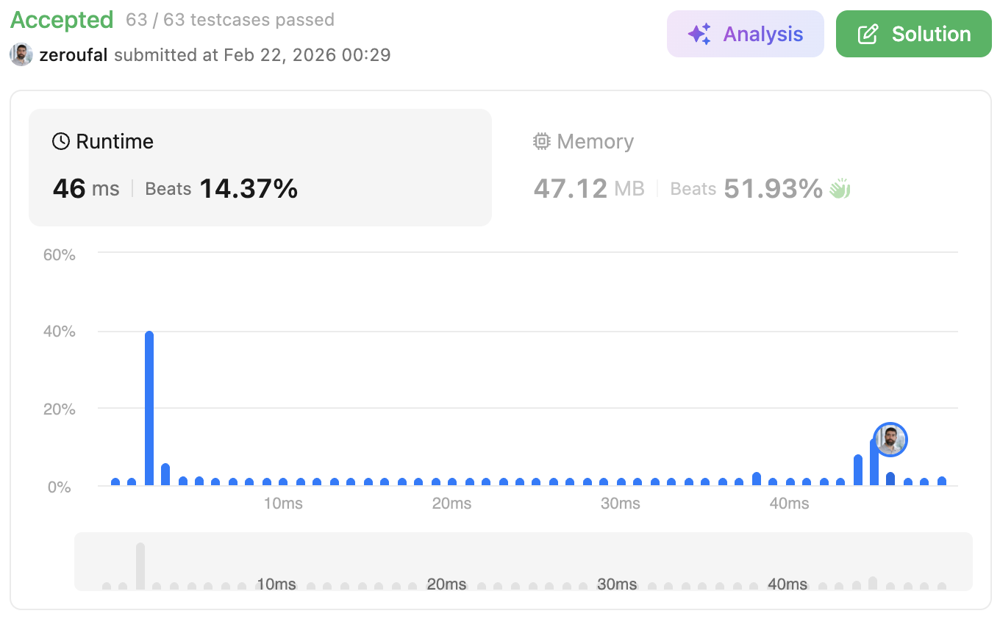

# 1. Two Sum
Given an array of integers nums and an integer target, return indices of the two numbers such that they add up to target.

---

## 💡 Approach
This solution uses a brute-force approach with O(n²) time complexity.
Although an optimized O(n) solution using a HashMap is well-known and more efficient, the goal here was to focus on correctness and move quickly through the problem set.
Given the problem constraints and the context of practicing multiple problems, the trade-off favors simplicity and iteration speed over optimal performance.
The optimized solution is straightforward and can be applied when needed.

---

## ⚠️ Edge Cases

- Input array with minimum size (e.g., 2 elements)
- Negative numbers
- Duplicate values (e.g., [3, 3])
- Multiple valid pairs (problem guarantees one valid solution)
- No valid solution (handled by returning a default value)

---

## ⏱ Complexity
- Time: O(n^2), This is a brute-force approach with O(n²) time complexity due to the nested loops.
- Space: O(1), Space complexity is O(1) since no additional data structures are used..

---

## 🧠 Why this approach?
Chosen for simplicity.

---

## 🔗 Problem
https://leetcode.com/problems/two-sum/

---

## ✅ Result

- Runtime: 46 ms (Beats 14.37%)
- Memory: 47.12 MB (Beats 51.93%)

---

## 🔗 Submission (login required)
https://leetcode.com/problems/two-sum/submissions/1926965151/