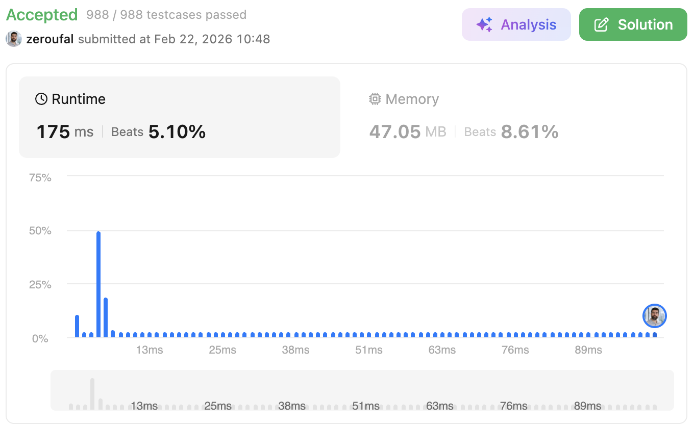

# 3. Longest Substring Without Repeating Characters
Given a string s, find the length of the longest substring without duplicate characters.

---

## 💡 Approach

The solution iterates through the string using two implicit pointers:

- `starter`: defines the beginning of the current substring
- `i`: traverses the string starting from `starter`

To store the unique characters of the current substring, a `StringBuilder` named `letters` is used.

The algorithm works as follows:

1. Iterate through the string character by character.
2. For each character:
   - If it **does not exist** in `letters`, append it and continue.
   - If it **already exists**, a repetition is found:
      - Update the result with the current length of `letters`.
      - Reset the `StringBuilder`.
      - Increment `starter` and restart the scan from there.
3. After the loop, ensure the final substring length is also considered.

---

## 🧠 Why This Approach?

This approach was chosen because it is:
- **Simple and straightforward**: easy to understand and implement without complex data structures.
- **Deterministic**: always restarts when a duplicate is found, ensuring correctness.
- **Suitable for initial submissions**: solves the problem correctly without requiring advanced optimizations.
Although it is not the most efficient solution, it is reliable and works well when clarity and correctness are the main priorities.

---

## ⚠️ Edge Cases

- **Empty string (`""`)**
   - Returns `0`.
- **Single character**
   - Example: `"a"` → result is `1`.
- **All characters are the same**
   - Example: `"aaaaa"` → result is `1`.
- **No repeating characters**
   - Example: `"abcdef"` → result equals the string length.
- **Adjacent duplicates**
   - Example: `"abba"` → requires correct restart of `starter`.
- **Separated duplicates**
   - Example: `"abcabcbb"` → ensures multiple restarts are handled correctly.

---

## ⏱ Complexity

- **Time Complexity:** `O(n²)`
   - For each starting position (`starter`), part of the string may be traversed again.
   - The `letters.indexOf()` operation is also `O(n)`.

- **Space Complexity:** `O(n)`:In the worst case, the `StringBuilder` stores all unique characters of the string.

---

## 🔗 Problem
https://leetcode.com/problems/longest-substring-without-repeating-characters/

## ✅ Result

- Runtime: 590 ms (Beats 5.10%)
- Memory: 47.34 MB (Beats 6.51%)

---

## 🔗 Submission (login required)
https://leetcode.com/problems/longest-substring-without-repeating-characters/submissions/1927477417