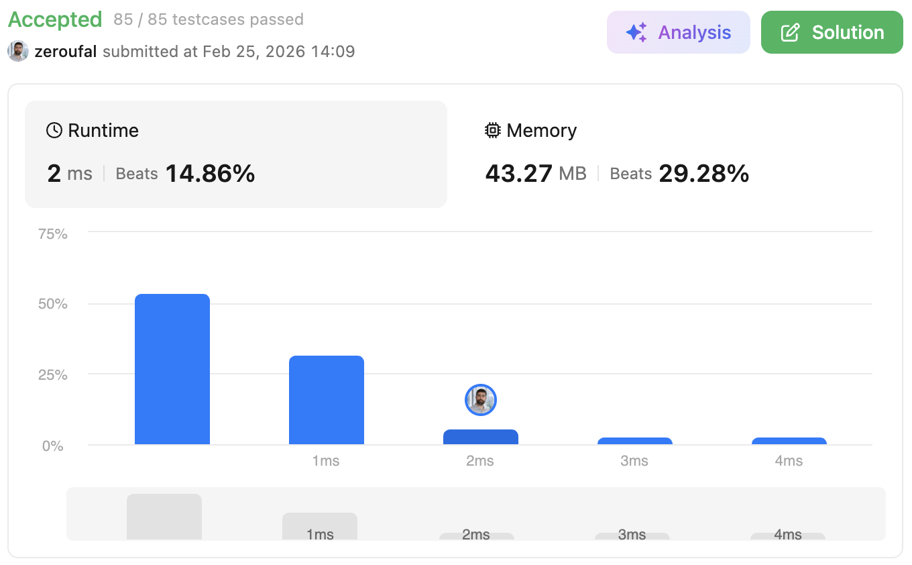

# 28. Find the Index of the First Occurrence in a String
Given two strings needle and haystack, return the index of the first occurrence of needle in haystack, or -1 if needle is not part of haystack.

---

## 💡 Approach
This solution uses a manual character-by-character comparison between `haystack` and `needle`, simulating a sliding window with controlled backtracking.

We iterate through `haystack` using a pointer `i`, while tracking the current match position in `needle` using `position`.

- When characters match:
    - Increment `position`
    - Store the starting index in `result` (if it's the first match)

- When characters do not match:
    - If a partial match was in progress, reset:
        - `position` to `0`
        - `i` back to the initial match index (`result`)
        - `result` to `-1`

- The loop stops early if:
    - There are not enough remaining characters in `haystack` to complete a match
    - The full `needle` has already been matched

At the end, we verify if a complete match was found by checking `position == needle.length()`.

---

## ⚠️ Edge Cases

## Edge Cases

- `needle` not present in `haystack` → return `-1`
- `needle` equals `haystack` → return `0`
- `needle` larger than `haystack` → return `-1`
- Repeated characters causing partial matches (e.g., `"aaaab"` vs `"aaab"`)
- Single character match
- Match occurring at:
    - Beginning
    - Middle
    - End of `haystack`

---

## ⏱ Complexity

- Time Complexity: **O(n * m)**  
  In the worst case, the algorithm may reprocess characters due to backtracking.

- Space Complexity: **O(1)**  
  No additional data structures are used.

---

## 🧠 Why this approach?
This version was already submitted and accepted, making it a practical and reliable solution for the problem.
Although more optimal algorithms like KMP can achieve **O(n + m)** time complexity, this implementation is:
- Easier to understand and implement under time constraints
- Sufficient for the given problem constraints (strings up to 10⁴ characters)
- Explicit in handling partial matches and backtracking without additional preprocessing

---

## 🔗 Problem
https://leetcode.com/problems/find-the-index-of-the-first-occurrence-in-a-string/

---

## ✅ Result

- Runtime: 2 ms (Beats 14.86%)
- Memory: 43,27 MB (Beats 29,28%)

---

## 🔗 Submission (login required)
https://leetcode.com/problems/find-the-index-of-the-first-occurrence-in-a-string/submissions/1931022156