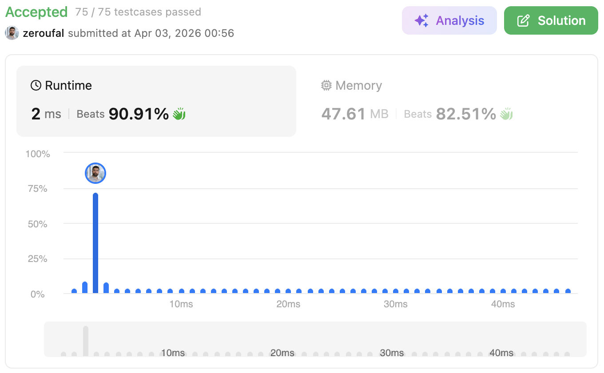

# 283. Move Zeroes
Given an integer array nums, move all 0's to the end of it while maintaining the relative order of the non-zero elements.

---

## 💡 Approach

The idea is to shift all non-zero elements forward while keeping their relative order, and then fill the remaining positions with zeroes.

We use three variables:

- `i` → iterates through the array
- `place` → tracks the position where the next non-zero element should go
- `counter` → counts how many zeroes are found

## 🧠 Why this approach?
- **In-place solution:** avoids extra arrays, saving memory.
- **Efficient writes:** the `place != i` condition prevents unnecessary overwrites.
- **Stable order:** preserves the relative order of non-zero elements.
- **Simple and readable:** uses a clear two-phase strategy (compaction + filling).

Compared to swap-based approaches, this version:
- Performs fewer assignments.
- Is easier to reason about.
- Avoids excessive element swapping.

## ⚠️ Edge Cases

- **All zeroes** → `[0,0,0]` → remains unchanged.
- **No zeroes** → `[1,2,3]` → no modifications needed.
- **Single element**:
    - `[0]` → `[0]`
    - `[1]` → `[1]`
- **Mixed values**:
    - `[0,1,0,3,12]` → `[1,3,12,0,0]`
- **Already optimized array** → minimal writes due to `place != i` check.

---

## ⏱ Complexity
- **Time Complexity:** `O(n)`
    - The array is traversed once.
    - Filling zeroes takes at most `O(n)` in total.

- **Space Complexity:** `O(1)`
    - The operation is done in-place without extra memory.

---

## 🔗 Problem
https://leetcode.com/problems/move-zeroes/

---

## ✅ Result

- Runtime: 2 ms (Beats 90.91%)
- Memory: 46.76 MB (Beats 82.51%)

---

## 🔗 Submission (login required)
https://leetcode.com/problems/move-zeroes/submissions/1967334893