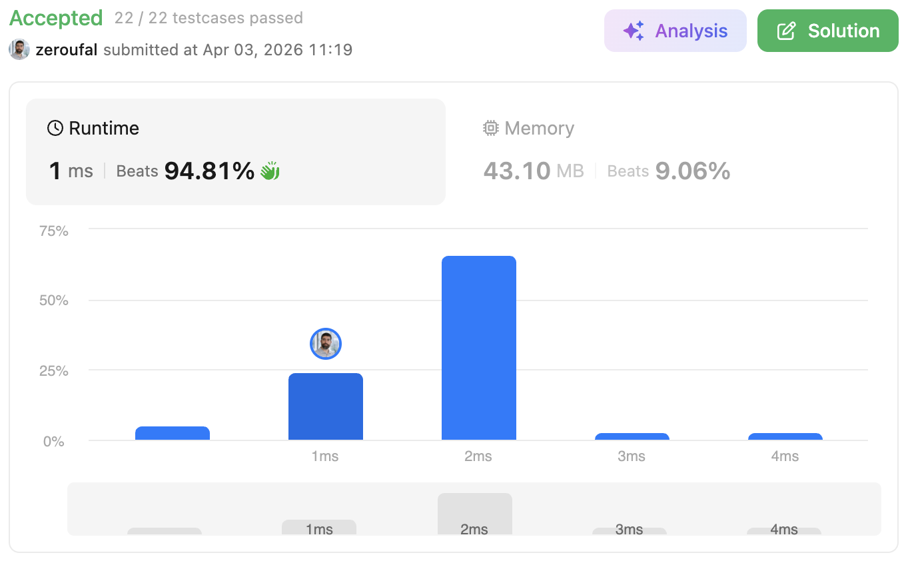

# 392. Is Subsequence
Given two strings s and t, return true if s is a subsequence of t, or false otherwise.

---

## 💡 Approach
We solve the problem using a **two-pointer technique**.

- One pointer (`pointerToS`) iterates over string `s`.
- Another pointer iterates through string `t`.

We scan `t` from left to right:
- Whenever we find a character in `t` that matches the current character in `s`, we move the `s` pointer forward.
- If we reach the end of `s`, it means all characters of `s` were found in order inside `t`.

Finally, we check whether we have matched all characters of `s`.

## 🧠 Why this approach?
- The two-pointer approach is **optimal and efficient** for subsequence problems.
- It avoids unnecessary comparisons and backtracking.
- It guarantees a **single pass over `t`**, making it scalable for large inputs.
- Compared to brute force or recursive solutions, this method is:
  - Simpler to implement
  - More performant
  - Easier to reason about

This approach leverages the key property of subsequences: **order matters, but continuity does not**.

## ⚠️ Edge Cases
- **Empty or null `s`:**  
  The current implementation returns `false`.  
  (Note: In the original LeetCode problem, an empty `s` is usually considered a valid subsequence.)

- **Empty or null `t`:**  
  Returns `false`, since no subsequence can be formed.

- **`s` longer than `t`:**  
  Automatically returns `false` because it's impossible to match all characters.

- **Characters not present in `t`:**  
  The loop completes without fully advancing the `s` pointer.

---

## ⏱ Complexity
- **Time Complexity:** `O(n)`: where `n` is the length of `t`. We traverse `t` only once.
- **Space Complexity:** `O(1)`: no extra space is used besides a few variables.

---

## 🔗 Problem
https://leetcode.com/problems/is-subsequence/

---

## ✅ Result

- Runtime: 1 ms (Beats 94.81%)
- Memory: 43.10 MB (Beats 9.06%)

---

## 🔗 Submission (login required)
https://leetcode.com/problems/is-subsequence/submissions/1967780459