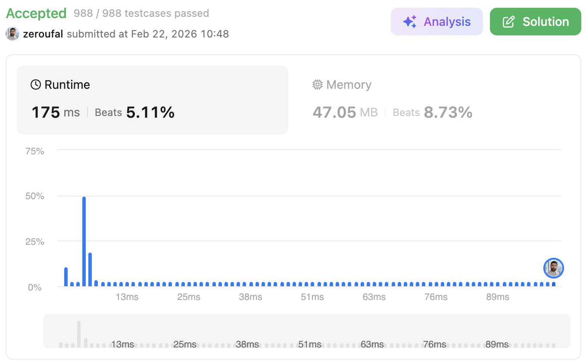

# 3. Longest Substring Without Repeating Characters
Given a string s, find the length of the longest substring without duplicate characters.

---

## 💡 Approach
This solution finds the length of the longest substring without repeating characters using a brute-force sliding restart strategy.

Key implementation details:
- A StringBuilder (letters) is used to store the current substring without duplicates.
- Two pointers are implicitly controlled:
  - starter: defines the starting index of the current substring
  - i: iterates forward from starter
- For each character:
  - If it is not present in letters, it is appended
  - If it already exists, the current substring is evaluated and:
   - result is updated
   - The substring is reset
   - starter is incremented
   - i is reset to the new starter
 - After the loop, a final check ensures the last substring is considered.

---

## ⚠️ Edge Cases

This implementation handles:

- Empty string
  - Returns 0 correctly
- String with all unique characters
  - Example: "abcde" → full length is returned
- String with all repeated characters
  - Example: "aaaaa" → result is 1
- Substrings that restart frequently
  - Example: "abba" → correctly evaluates multiple restarts
- Final substring check
  - Ensures last valid sequence is not ignored

---

## ⏱ Complexity
- Time: O(n^2), In the worst case, the algorithm restarts the scan for each character.
- Space: O(n), The StringBuilder can grow up to the size of the longest substring without repeating characters.

---

## 🧠 Why this approach?
- Simple and easy to reason about
- Explicitly explores all possible substrings starting at each position
- Avoids complex data structures

---

## 🔗 Problem
https://leetcode.com/problems/add-two-numbers/

---

## ✅ Result

- Runtime: 175 ms (Beats 5.11%)
- Memory: 47.05 MB (Beats 8.73%)

---

## 🔗 Submission (login required)
https://leetcode.com/problems/longest-substring-without-repeating-characters/submissions/1927477417