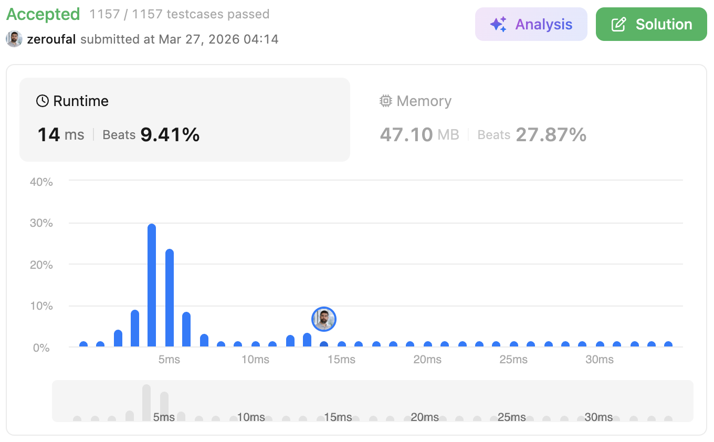

# 6. Zigzag Conversion
The string "PAYPALISHIRING" is written in a zigzag pattern on a given number of rows, and then read line by line: "PAHNAPLSIIGYIR".

---

## 💡 Approach
The solution simulates the zigzag pattern by distributing characters across multiple rows.

We create a list of lists (`matrix`), where each inner list represents a row in the zigzag pattern. Then, we iterate through the input string and place each character into the appropriate row.

To control the movement between rows, we use:
- `rowcount`: tracks the current row
- `direction`: determines whether we are moving **down (+1)** or **up (-1)**

When we reach:
- the **top row (0)** → change direction to **down**
- the **bottom row (numRows - 1)** → change direction to **up**

After filling all rows, we concatenate all characters row by row to build the final string.

---

## ⚠️ Edge Cases

- **`numRows == 1`**  
  The zigzag becomes a straight line, so we return the original string.

- **`numRows >= s.length()`**  
  No zigzag effect occurs. The output is the same as the input.

---

## ⏱ Complexity
- **Time Complexity:** `O(n)`  
  We traverse the string once to distribute characters and once more to build the result.

- **Space Complexity:** `O(n)`  
  We store all characters in the matrix structure.

---

## 🧠 Why this approach?
This approach is intuitive because it directly simulates how the zigzag pattern is formed.

Instead of relying on complex index calculations, we:
- Move through rows using a simple direction control
- Store characters in a structure that mirrors the visual pattern
- Keep the logic clean and easy to follow

Using a `direction` variable makes transitions between rows straightforward, improving both readability and maintainability.

---

## 🔗 Problem
https://leetcode.com/problems/zigzag-conversion/

---

## ✅ Result

- Runtime: 14 ms (Beats 9.41%)
- Memory: 47.10 MB (Beats 27.87%)

---

## 🔗 Submission (login required)
https://leetcode.com/problems/zigzag-conversion/submissions/1960660129