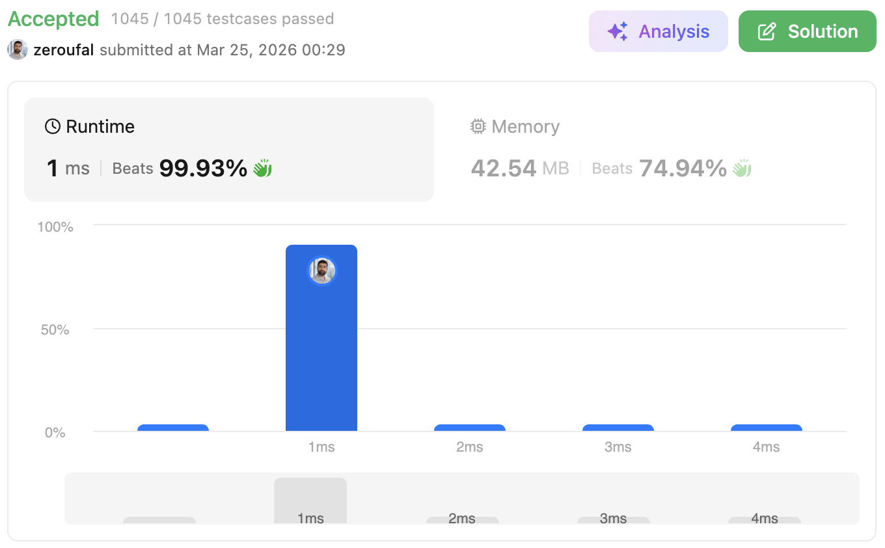

# 7. Reverse Integer
Given a signed 32-bit integer x, return x with its digits reversed. If reversing x causes the value to go outside the signed 32-bit integer range [-231, 231 - 1], then return 0.
Assume the environment does not allow you to store 64-bit integers (signed or unsigned).

---

## 💡 Approach
The solution follows an iterative approach simulating manual addition, processing both linked lists digit by digit while maintaining a carry (vai1).

Key implementation details:
- Instead of using a dummy node, the first node of the result list is created before entering the loop.
- Two pointers (next1 and next2) are used to traverse the input lists.
- A do-while loop ensures that the algorithm continues as long as at least one list still has nodes.
- At each step:
  - The sum is calculated using current node values and the carry.
  - If the sum is greater than or equal to 10, a carry is generated.
  - A new node is appended to the result list.
- After the loop, if there is a remaining carry, it is appended as a new node.

---

## ⚠️ Edge Cases
This implementation explicitly handles:

- `x = 0` → should return `0`
- Single digit numbers → should return the same number
- Negative numbers → should preserve the sign (e.g., `-123 → -321`)
- Numbers ending with zero → leading zeros must be removed (`120 → 21`)
- Overflow cases:
  - Values that exceed `Integer.MAX_VALUE (2147483647)`
  - Values that go below `Integer.MIN_VALUE (-2147483648)`
- Boundary values:
  - `Integer.MAX_VALUE → 0`
  - `Integer.MIN_VALUE → 0`

---

## ⏱ Complexity
- **Time Complexity:** `O(log10(n))`  
  Each iteration processes one digit of the number.

- **Space Complexity:** `O(1)`  
  No extra space is used apart from a few variables.

---

## 🧠 Why this approach?
This approach is optimal because it processes the number in a single pass without converting it to a string or using extra memory.

The key challenge of the problem is handling overflow without using a larger numeric type. By checking the limits before updating the result, we ensure correctness while staying within the constraints.

Additionally, this method is efficient, simple, and aligns with how low-level arithmetic operations work, which is often expected in technical interviews.

---

## 🔗 Problem
https://leetcode.com/problems/reverse-integer/

---

## ✅ Result

- Runtime: 1 ms (Beats 99.93%)
- Memory: 42.54 MB (Beats 74.94%)

---

## 🔗 Submission (login required)
https://leetcode.com/problems/reverse-integer/submissions/1958379496